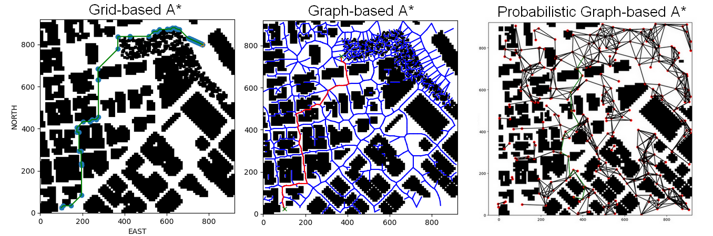
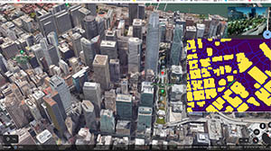
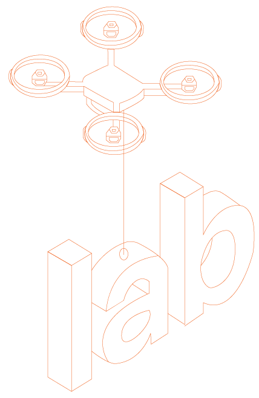

[![Contributors][contributors-shield]][contributors-url]
[![Forks][forks-shield]][forks-url]
[![Stargazers][stars-shield]][stars-url]
[![Issues][issues-shield]][issues-url]
[![MIT License][license-shield]][license-url]
[![LinkedIn][linkedin-shield]][linkedin-url]
[](http://hits.dwyl.com/aiegoo/finalproject)
[![HitCount][hit-shield]][hit-url]

<br />
<p align="center">
    
  </a>

  <h3 align="center">Autonomous UAV</h3>

  <p align="center">
     Path planner, cascaded controller, extended kalman filter...
    <br />
    <a href="https://github.com/aiegoo/drones/wiki"><strong>Explore the docs »</strong></a>
    <br />
    <br />
    <a href="https://github.com/aiegoo/drones/wiki/simulator-samples">View Demo</a>
    ·
    <a href="https://github.com/aiegoo/finalproject/issues">Report Bug</a>
    ·
    <a href="https://github.com/aiegoo/finalproject/pulls">Pull Request</a>
  </p>
</p>


## Table of Contents

- [Table of Contents](#table-of-contents)
- [About the Project](#about-the-project)
    - [Introduction / statement of purpose](#introduction--statement-of-purpose)
- [Setup](#setup)
- [Run](#run)
    - [Matplotlib planning](#matplotlib-planning)
  - [Control and Estimation Simulator](#control-and-estimation-simulator)
- [Visualization](#visualization)
  - [Simulator Control](#simulator-control)
- [Roadmap](#roadmap)
- [Contribute](#contribute)
    - [:wavy_dash: references](#wavy_dash-references)
  - [Contribute on proposed features](#contribute-on-proposed-features)
- [License](#license)
- [Contact](#contact)
- [Contributors](#contributors)

## About the Project

#### Introduction / statement of purpose [googledocs file](https://docs.google.com/document/d/1Qm3wPX6avlFVy6BahFfp8X-skUXxXDU26JX0ie-TXc8/edit?usp=sharing)

My goal during and after this course is to design an autonomous UAS to work under any circumstances for the logistics industry. While this goal is too broad and requires various apprentices in the field of navigation, aeronautics and programming in low-level to higher-level languages, I have focused on different GSC and simulator platforms such as QGC, Gazebo, Matlab, Cleanflight Configurator and FCND among others. I have also used various open-source and proprietary drones (see my [hardwares](./Required-Hardware.md)). In this project, I have achieved the following:

- Action pipeline based on bash scripts and webserver to pull and update code changes remotely. 
- Python- and ROS-based connection to each nodes
- Use of Kalman and other filters to produce navigatable simulation maps. 
- Plotting realtime data

When successfully deployed, I should be able to monitor the vehicle status and react to events remotely through script changes, reducing human involvement in most normal UAS operations.

## Setup
> overview


> lora on drones


## Run

#### Matplotlib planning

as built in the Motion Planner :100:

1. Grid
2. Medial Axis
3. Voronoi Graph
4. Heuristic Graph


<p align="center">
     
</p>                                                                          
<p align="center">
    
</p>
<hr>


### Control and Estimation Simulator


To use the simulator for control testing, follow these steps :

## Visualization

> model class
```
SessionSerializer, MovementSerializer, GlobalPoistionSerializer, GlobalHomeSerializer, LocalPositionSerializer, LocalHomeSerializer, LocalVelocitySerializer, etc
```

:hammer: I've never been a good db person who still loves to dump everything in a single db table, but the data flowing out from the flight data and a flying vehicle can be msasscaring any semblance of solidines of database structues. I expected the db can love me back in selfishless ways, but it turned out that I have to take the bulls by the horn, alas with allmighty and still unsuccesful. Even with the Django's third-party rest_framework,  this project proves that there is a long way to go for me. Hooray!!

> 

| Simulator  | Details   | Front-end integration | Details|
|---|---|---|---|
| [](https://youtu.be/E7Fl_TwEi_I) |Ardupilot and px4-based simulator | [](https://youtu.be/8dkMs62s8-w) | Django, Postgresql, Vue, Axios and Kalman libraries. Live vehicle tracking |

### Simulator Control

## Roadmap

## Contribute

Contributions are what make the open source community such an amazing place to learn, inspire, and create. Any contributions you make are **greatly appreciated**.

#### :wavy_dash: references
* Kalman filters, MCL algorithms, Occupancy Grid Mapping algorithm, FastSLAM, GraphSLAM, ROS Navigation Stack 7, Probabilistic Path Planning, Drone FCND, KUKA Path planning, OpenCV, RNN, CNN, Navigator, PID Control
* books referenced in this project:
```
Mastering ROS for Robotics Programming Packt
Learning ROS for Robotic Programming 2nd Edition
ROS for Beginners, Basics, Motion and OpenCV
ROS로보틱스 
Boost.Asio C++ 네트워크 프로그래밍 쿡북
```

### Contribute on proposed features

To create a PR:

Follow the given link to make a successful and valid PR: https://help.github.com/articles/creating-a-pull-request/

To send a PR, follow these rules carefully, **otherwise your PR will be closed**:

1. Make PR title in this formats: 
```
Fixes #IssueNo : Name of Issue
``` 
```
Feature #IssueNo : Name of Issue
```
```
Enhancement #IssueNo : Name of Issue
```

According to what type of issue you believe it is.

For any doubts related to the issues, i.e., to understand the issue better etc, comment down your queries on the respective issue.

## License

Distributed under the MIT License. See `LICENSE` for more information.

## Contact

## Contributors

[saythanks-shield]: https://img.shields.io/badge/Say%20Thanks-!-1EAEDB.svg?style=flat-square
[saythanks-url]: https://saythanks.io/to/onofftony@gmail.com?style=flat-square
[contributors-shield]: https://img.shields.io/github/contributors/aiegoo/finalproject.svg?style=flat-square
[contributors-url]: https://github.com/aiegoo/finalproject/graphs/contributors
[forks-shield]: https://img.shields.io/github/forks/aiegoo/finalproject.svg?style=flat-square
[forks-url]: https://github.com/aiegoo/finalproject/network/members
[stars-shield]: https://img.shields.io/github/stars/aiegoo/finalproject.svg?style=flat-square
[stars-url]: https://github.com/aiegoo/finalproject/stargazers
[issues-shield]: https://img.shields.io/github/issues/aiegoo/finalproject.svg?style=flat-square
[issues-url]: https://github.com/aiegoo/finalproject/issues
[license-shield]: https://img.shields.io/github/license/aiegoo/finalproject.svg?style=flat-square
[license-url]: https://github.com/aiegoo/finalproject/blob/master/LICENSE.md
[linkedin-shield]: https://img.shields.io/badge/-LinkedIn-black.svg?style=flat-square&logo=linkedin&colorB=555
[linkedin-url]: https://linkedin.com/in/tonyleekorea
[hit-shield]: http://hits.dwyl.com/aiegoo/finalproject.svg?style=flat-square
[hit-url]: http://hits.dwyl.com/aiegoo/finalproject/projects/1
